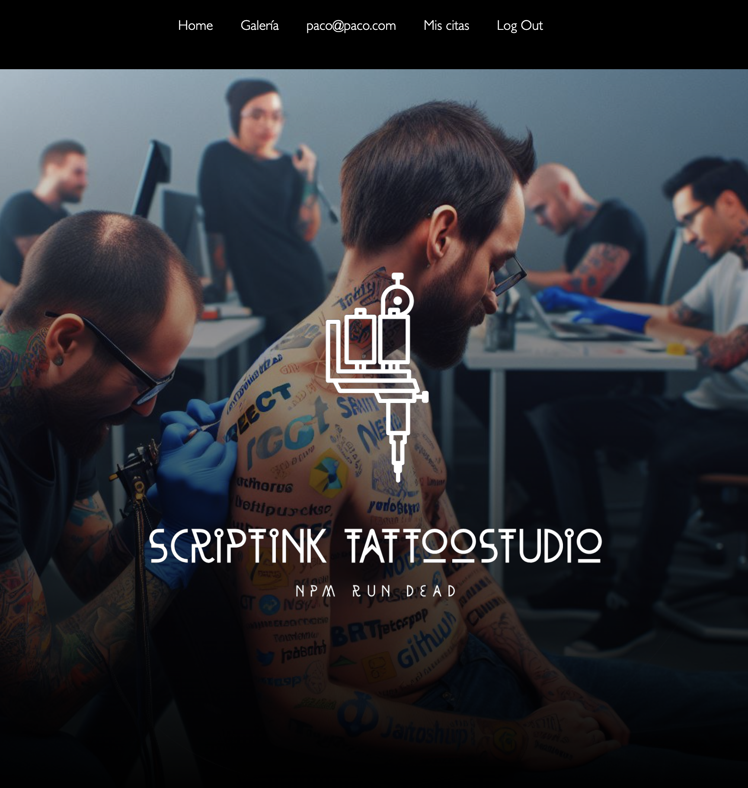
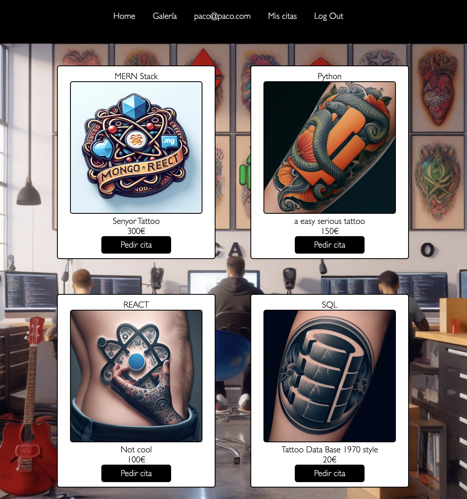

# ScriptInk Tattoo Studio
### by Paco Fuentes
---
<a href="https://www.reactjs.com/">
    
</a>

---

<details>
  <summary>Contenido 📝</summary>
  <ol>
    <li><a href="#objetivo-🎯">Objetivo</a></li>
    <li><a href="#sobre-el-proyecto-🔎">Sobre el proyecto</a></li>
    <li><a href="#deploy-🚀">Deploy</a></li>
    <li><a href="#stack">Stack</a></li>
    <li><a href="#install">Install</a></li>
    <li><a href="#views">Views</a></li>
    <li><a href="#futuras-funcionalidades">Futuras funcionalidades</a></li>
    <li><a href="#contribuciones">Contribuciones</a></li>
    <li><a href="#licencia">Licencia</a></li>
    <li><a href="#contacto">Contacto</a></li>
  </ol>
</details>

## Objetive 🎯
The ScriptInk Tattoo Studio Web App harmonizes a user-friendly frontend, seamlessly integrating with a pre-existing backend. Leveraging technologies like React, Redux, CSS, and Bootstrap, our goal is to elevate the tattoo experience, creating a seamless platform for design exploration and appointment scheduling.

## About🔎
Welcome to ScriptInk Tattoo Studio, where art meets technology in our user-friendly web application. Our studio seamlessly blends the power of React, Redux, CSS, Bootstrap, and more to bring you an effortlessly managed experience for exploring and booking your next tattoo. Dive into the world of ScriptInk, where your creativity takes center stage, supported by the simplicity and functionality of our web application. Join us in making your tattoo journey a memorable one!

## Deploy 🚀
<div align="center">
    <a href="https://www.google.com"><strong> Coming soon... </strong></a>🚀🚀🚀
</div>

## Stack
<div align="center">
<a href="https://www.reactjs.com/">
    
</a>
<a href="https://developer.mozilla.org/es/docs/Web/JavaScript">
    
</a>
 </div>

 ## Views

 ### Guest:

 / : home, main view

 <a href="https://www.reactjs.com/">
    
</a>

 /register : user register view

 <a href="https://www.reactjs.com/">
    
</a>

/login : login registered users and staff, wokers and admin

<a href="https://www.reactjs.com/">
    
</a>

/gallery : select tattoo view

<a href="https://www.reactjs.com/">
    
</a>

/gallery : select tattoo view (detail)

<a href="https://www.reactjs.com/">
    
</a>

### User

/createappointment : select tattoo view (detail)

<a href="https://www.reactjs.com/">
    
</a>

/myappointments : all appointments view

<a href="https://www.reactjs.com/">
    
</a>

/myappointments/id : detailed and date aditable appointment view

<a href="https://www.reactjs.com/">
    
</a>

/profile : see and edit user profile

<a href="https://www.reactjs.com/">
    
</a>

### Tattoo Artist

/myappointments : all artist works schedule

<a href="https://www.reactjs.com/">
    
</a>

/myappointment/id : detailed appointment view, edit and delete

<a href="https://www.reactjs.com/">
    
</a>

### Admin

/admin : get all users and delete selected user

<a href="https://www.reactjs.com/">
    
</a>

---
## Install

This is frontend app of a previously finished backend project on:

https://github.com/paco-fuentes/backend-tattoo-studio

Dowload and follow install intructions. You can populate your database with included sql files.

Then clone this repository.

Open terminal on project folder:

1. Clone this repo
```bash
      git clone url
```
2. Install dependencies

```bash
      npm i
```

3. Run this project in dev mode: 

```bash
      npm run dev
````

4. Press 'o' on the terminal window to open localhost: on your browser


